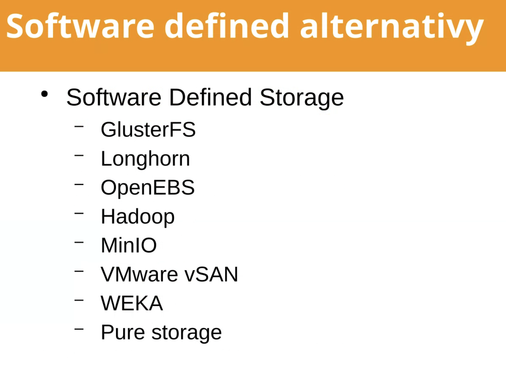

> PHP aplikace běží na 1 serveru, který pomalu přestává stíhat. Potřebujeme tedy spustit více instancí aplikace a provoz mezi ně rozdělit. Problém je, že soubory, které uživatelé nahrávají přes aplikaci se ukládají do pevně dané složky na serveru na disk. Když někdo nahraje soubor, ten se uloží na instanci 1, ale další požadavek může jít z instance 2 a tam ten soubor nebude. Jak bys to vyřešil? (Nepiš k tomu žádný kód, ale dej prosím dohromady konkrétní a detailní návrh řešení.)

---

Napadla me nasledujici mozna reseni:
- **Nastavit konfiguraci tak, aby pri praci s obrazky vychazela vzdy z prvni intance** - V zacatku mi to prijde jako nejjednodussi krok. Nicmene se zvysujici se zatezi muze zpusobovat pretezovani prvni instance serveru. I tak muze klast naroky na mirny refaktoring, aby uploud a prace se soubory vychazeli z centralizovanych umisteni, ktera se daji popsat. Po tomto bych tedy v pripade, ze to projekt dovoli a dava to casovy/financni smysl pristoupil k druhe odrazce.
- **Prevest obrazky do nejake object storage** - Zde bude nejspise nutny refaktoring, nicmene odebrani zavislosti mista behu aplikace a mista prace s obrazky podpori budouci moznosti vice instanci a muze predejit pripadnym problemum.
- **Mount slozky s obrazky napric instancemi** - Slozka s obrazky v prvni instanci se mountne do kazde nove instance.
- **Ulozeni do MongoDB** - Tento pristup mel kolega na predchozim projektu, ktery resil. Jednalo se ciste o obrazky realizaci, casto se nemenili a byli spise pro cteni. Fungovalo mu to dobre.
- **Replikace mezi instancemi** - V ramci morning talks jsem poslouchal prednasku o CEPH.

## Nastaveni Load Balancer
Konkretni lokaci pro cteni napr. /uploads/ budu smerovat vzdy na prvni instanci, kde jsou soubory.

### NGINX
https://docs.nginx.com/nginx/admin-guide/load-balancer/http-load-balancer/
```
http {
    upstream backend {
        server backend1.example.com;
        server backend2.example.com;
    }

    server {
        listen 80;

        location /uploads/ {
            proxy_pass http://backend1.example.com;
            ...
        }

        location / {
            proxy_pass http://backend;
            ...
        }
    }
}
```

### HAProxy
https://www.haproxy.com/blog/haproxy-configuration-basics-load-balance-your-servers
```
frontend myfrontend
    bind *:80
    acl is_uploads path_beg /uploads/
    acl is_do_uploads path_beg /api/upload/
    use_backend special if is_uploads
    use_backend special if is_uploads
    default_backend myservers

backend special
    server server1 backend1.example.com

backend myservers
    server server1 backend1.example.com
    server server2 backend2.example.com
```

## S3

Prvni, co mne napadlo je prechod na s3/s3 compatible reseni. Znamena to upravit aplikaci a prevest soubory do object storage. Pouziti pak nebude zavisle na instanci.

V takovem pripade by to pak chtelo fyzicky premistit soubory na dedikovane uloziste. Upravit ukladaci/cteci mechanizmus, aby cetlo z daneho umisteni narozdil od aktualniho systemu. Cesta k souboru je povetsinou ulozena v DB, tzn. znamenalo by to hromadnou upravu cesty ke vsem souborum.

Pouzivali jsme napr. https://packagist.org/packages/league/flysystem

Tohle reseni je dle meho nejlepsi z pohledu rustu projektu. Mam jedno misto pro CRUD operace nad fyzickymi soubory mimo svoji infrastrukturu.

## Sdileni slozky napric instancemi
https://wiki.debian.org/NFSServerSetup
https://docs.aws.amazon.com/AWSEC2/latest/UserGuide/making-instance-stores-available-on-your-instances.html
https://kubernetes.io/docs/concepts/storage/persistent-volumes/

Tento koncept jsme pouzivali na sdileni statickych souboru jako jsou konfigurace, certifikaty atd. Pro cteni obrazku by asi problem nebyl, nejsem si uplne jist zapisem. Tam bych asi spojil s nastavenim konfigurace load balanceru, aby upload vzdy smeroval z jednoho mista.

## MongoDB
https://www.mongodb.com/docs/manual/core/gridfs/

## Replikace mezi instancemi
S kolegou, co mel fotky v MongoDB jsme se bavili, ze pokukuje po sluzbe https://min.io/product/active-data-replication-for-object-storage, nicmene aplikaci neznam.

Z morning talk vim, ze sluzby typu CEPH, MinIO funguji, ale realne pouziti jsem nikdy nevidel.


